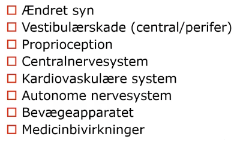

# §Fald
## Generelt
Q. Hvad er de tre overordnede årsager til [[§Fald]]?
A. 1) [[Svimmelhed]], 2) [[§Synkope]], 3) Balanceproblemer

Se især [Svimmelhed – FraseDoktor](https://www.frasedoktor.dk/fraser/svimmelhed/).

## Differentialdiagnose

[[SIADH]]

## Udredning
Udredning efter formodet årsag, desuden som nedenfor.

### Anamnese
Medicingennemgang

### Objektiv us.
Timed-up-and-go
Rejse-sætte-sig test
Dynamisk Gang Index
Smooth pursuit

### Paraklinik
Væsketal/glukose

Holter + EKG
	Carotismassage

MMSE/ACE

*Tabel 11.3 i M-bogen*

## Behandling
Efter årsag. Desuden styrketræning.

Faldforebyggelse:
1. Fjerne udløsende faktorer hjemme
2. KRAM
3. [[Behandling af osteoporose (se osteoporose)]]

## Opfølgning

## Prognose

## Backlinks
* [[§Fald]]
	* Q. Hvad er de tre overordnede årsager til [[§Fald]]?

<!-- #anki/tag/med/Geri #anki/deck/Medicine -->

<!-- {BearID:167CDDBB-E325-4D60-96A0-812C88BBEAE6-61893-0000C406452FB809} -->
