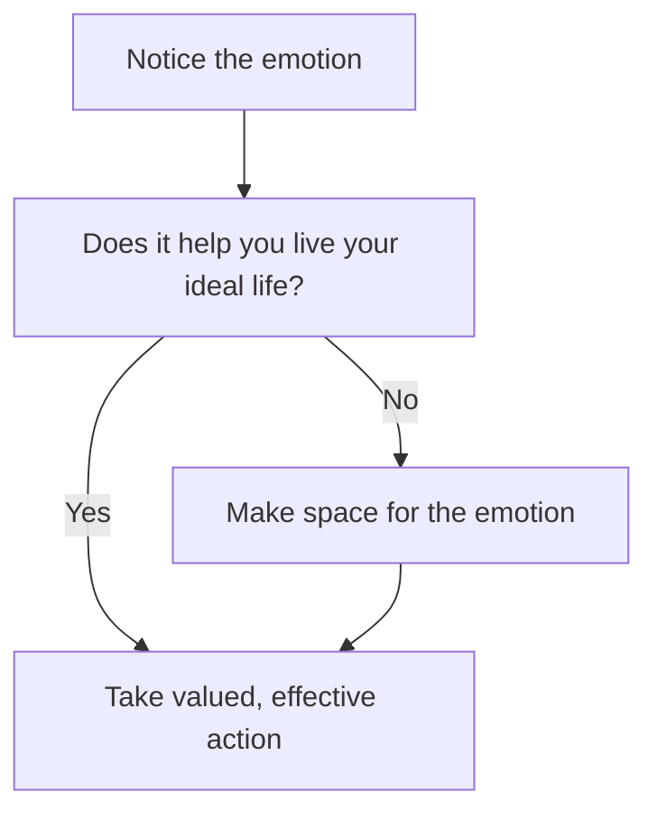

# §How to relate to emotions
Relating to [[Emotions]] can be a large driver in how you spend your life, so it makes sense to figure out how to do it most effectively. Blah!

I believe that [[Chasing positive affect leads to suffering]] and [[Avoiding negative affect leads to suffering]]. Why is that?

First of all, [[It is normal to experience discomfort]], since [[We can't prevent all discomfort]], [[Emotions are unstable]] and [[Negative affect can contain information]]. Furthermore, [[A meaningful life contains discomfort]], making discomfort even more prevalent.

This means that we're all going to experience discomfort. How we handle it, then, is important.

Since [[We have limited control over what we feel]], trying to control emotions is likely futile. Not only that, but [[Thoughts about emotions can cause problems]]

Instead, [[Make room for your feelings when they become unhelpful]] and [[Focus on your actions]], since they're relatively within your control.

Essentially, I believe that allowing emotions to determine action in the moment is detrimental.

In contrast, long-term emotions are the guiding light for [[§Clarify your values to know which actions to take]].

<!-- #Life -->

<!-- {BearID:F9AB0D18-8E47-415E-82B1-8EB39BD383ED-15756-00001303237D3756} -->
