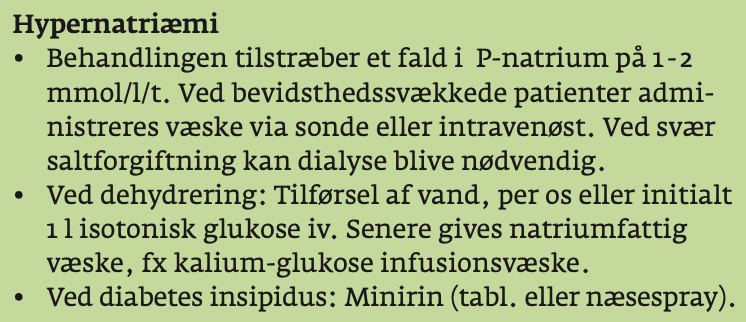

# §Hypernatriæmi
## Generelt

## Differentialdiagnose

## Udredning
### Anamnese

### Objektiv us.

### Paraklinik

## Behandling

## Opfølgning

## Prognose

<!-- #anki/deck/Medicine #anki/tag/med/Acute care# -->

<!-- {BearID:6811756E-F9A8-445A-AE3F-1438BA6AB223-15714-000036C2FAC9819F} -->
