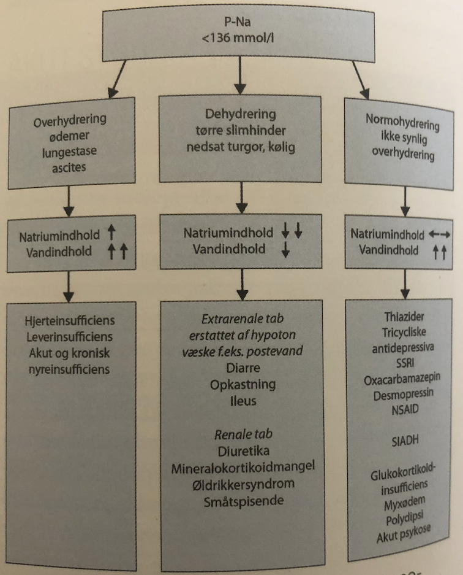
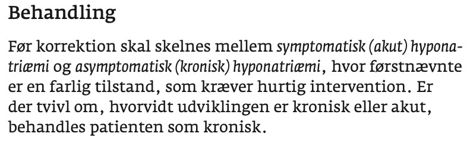
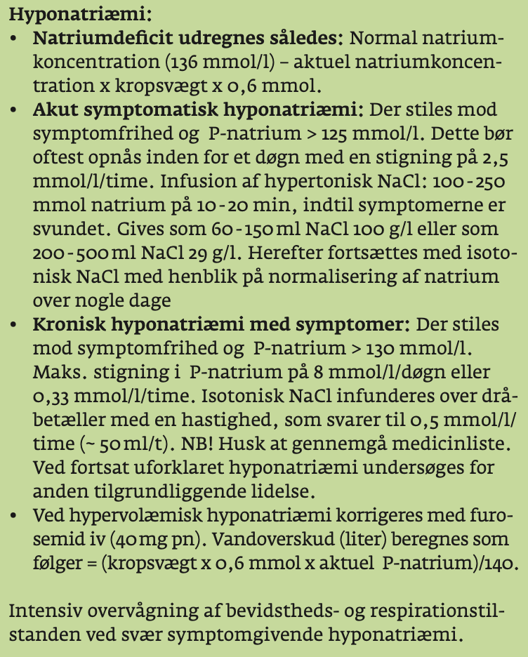

# §Hyponatriæmi
## Generelt
Hyponatriæmi ved pneumoni, typisk generelt (de har pt. kortvarigt).

http://www.endocrinology.dk/index.php/6-andre-endokrinologiske-sygdomme/2-hyponatriaemi

Q. Hvordan opdeles [[§Hyponatriæmi]]?
A. [[Dehydreret hyponatriæmi]], [[Normohydreret hyponatriæmi]] og [[Overhydreret hyponatriæmi]]

## Differentialdiagnose
Q. Hvilke differentialdiagnoser findes til [[Overhydreret hyponatriæmi]]?
A. 1) [[Hjerteinsufficiens]], 2) [[Leverinsufficiens]], 3) [[Nyreinsufficiens]]

Q. Hvilke differentialdiagnoser findes til [[Dehydreret hyponatriæmi]]?
A. Ekstrarenale tab erstattet med hypoton væske: 1) Opkastninger, 2) Ileus, 3) Diarre. Renale tab: 1) Småtspisende, 2) Diuretika, 3) Aldosteron-mangel, 4) Øldrikkersyndrom

Q. Hvad er de primære årsager til [[Normohydreret hyponatriæmi]]?
A. 1) [[SIADH]], 2) Svær [[Hypothyreose (myxødem)]], 3) [[Binyrebarkinsufficiens]], 4) Medicin-bivirkning (SSRI, TCA, NSAID)

## Udredning
### Anamnese

### Objektiv us.

### Paraklinik

## Behandling
Q. Hvordan behandles [[§Hyponatriæmi]]?
A. 1) Fjern udløsende årsag, 2) Erstat Na+

Q. En patient har svær [[§Hyponatriæmi]] og symptomer. Hvad nu?
A. Korriger *efter skema* for at undgå [[Osmotisk demyeliniseringssyndrom]]. 

[Natrium-folderen](http://www.dasaim.dk/wp-content/uploads/2019/10/Natriumfolder-011019.pdf)

Q. Hvor hurtigt må [[§Hyponatriæmi]] korrigeres?
A. Hvis kronisk (alle indlagte), højest <8 mmolær pr. døgn

## Opfølgning

## Prognose

## Backlinks
* [[SIADH]]
	* Q. Hvorfor giver SIADH [[§Hyponatriæmi]]?
* [[§Hyponatriæmi]]
	* Q. Hvordan opdeles [[§Hyponatriæmi]]?
	* Q. Hvordan behandles [[§Hyponatriæmi]]?

	* Q. En patient har svær [[§Hyponatriæmi]] og symptomer. Hvad nu?
	* Q. Hvor hurtigt må [[§Hyponatriæmi]] korrigeres?

<!-- #anki/tag/med/Geri #anki/deck/Medicine #anki/tag/med/Endocrinology -->

<!-- {BearID:AB0FDFE3-06E1-4AAB-BDE5-6CB0F3BF8766-9395-0000275F6BCD34E9} -->
