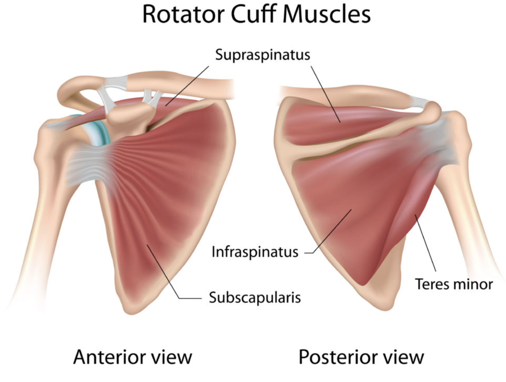

# §Rotator cuff
[[Rotator cuff læsion]]

Q. Hvilke muskler indgår i rotator-cuffen? 
A. TISS: 1) Teres minor, 2) Infraspinatus, 3) Supraspinatus og 4) Subscapularis

Q. Hvordan undersøges funktionen af [[Supraspinatus]]?
A. Abduktion af skulderen

Q. Hvordan undersøges funktionen af [[Infraspinatus]]?
A. Udadrotation

Q. Hvordan undersøges funktionen af [[Subscapularis]]?
A. [[Lift-off test]]

Q. Beskriv [[Lift-off test]] i skulderen.
A. Patienten placerer hånd på lænden og skubber den posteriort

Q. Hvad tester [[Lift-off test]] for i skulderen?
A. Funktion af indadrotation ([[Subscapularis]])

Q. Hvilken test kan bruges til at teste indadrotation i skulderen?
A. [[Lift-off test]]

Q. Hvad er et abnormt resultat af [[Lift-off test]] i skulderen?
A. At hånden ikke kan løftes fra ryggen

Q. Hvordan undersøges funktionen af [[Teres minor]]?
A. Udadrotation

## Backlinks
* [[Degenerative skulderlidelser]]
	* [[§Rotator cuff]]

<!-- #anki/tag/med/Orto #anki/deck/Medicine c -->

<!-- {BearID:456ABE78-922F-4B7B-85DB-7091D9D8722B-9395-000024D1944FCF99} -->
