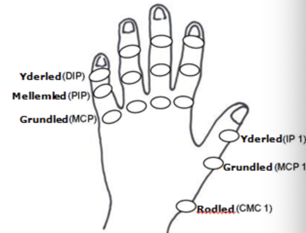

# §Tommelen
[[Tommelfingersmerter]]

Q. Hvor mange grader kan raske tommelfingre *flektere*? 
A. 45

Q. Hvor mange grader kan raske tommelfingre *ekstendere*? 
A. 45

Q. Hvor mange grader kan raske tommelfingre *abducere*? 
A. 40

Q. Hvor mange grader kan raske tommelfingre *adducere*? 
A. 40

Q. En patient har traume mod tommelen. Hvad skal undersøges?
A. Sensibilitet, smerter i tabatieren, muskelstyrke, løshed (OBS: Ulnar ligament-læsion)

Q. En patient har et snitsår 20 cm. distalt for albuen. Hvad skal undersøges objektivt?
A. Såret beskrives, funktion, sensibilitet og vaskularitet distalt for undersøges

Q. Hvilke led findes i tommelfingeren?
A. CMC, MCP og DIP

 

## Backlinks
* [[Undersøgelsesteknik]]
	* [[§Tommelen]]

<!-- #anki/tag/med/Orto #anki/deck/Medicine -->

<!-- {BearID:0F3EF329-8912-4678-958C-0163CF5D663D-85278-000062BDD95E447C} -->
