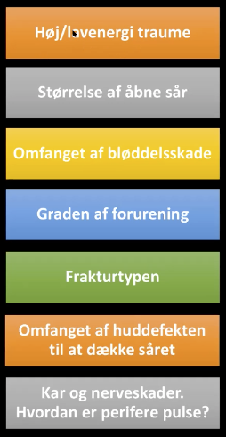
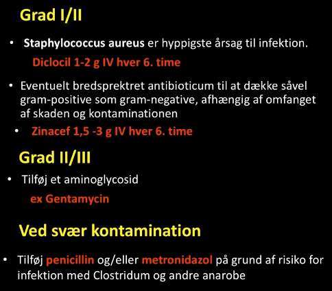

# Åbne brud
## Generelt
Q. Hvad bruges *[[Gustilo-Anderson klassifikationen]]* til? 
A. *Klassifikation af åbne brud*

Q. Hvilke *klassifikation af åbne brud* bruges i sundhedsvæsenet? 
A. *[[Gustilo-Anderson klassifikationen]]* 

Q. Hvilke kategorier indgår i [[Gustilo-Anderson klassifikationen]]?
A. Type I) < 1 cm, 2) < 10 cm, 3) > 10 cm. Type III inddeles i A) Ordentlig dækning, B) Utilstrækkelig dækning, C) Med vaskulære skader der kræver reparation.

## Differentialdiagnose

## Udredning
### Anamnese
Q. Din patient er blevet kørt over af en bil. Hvad nu?
A. Traumekald. Derefter, OBS [[Decollementlæsion]]. Hvis mindste mistanke, indlæg.

### Objektiv us.

### Paraklinik

## Behandling
### Grovreponering
Q. Du har reponeret på en åben fraktur, som ikke havde puls. Stadig ingen puls. Hvad nu?
A. A) Hvis lyserød perifær for, akut. Ellers hyperakut B) akut A-grafi, dernæst på OP.

Q. Din patient har en fraktur i underarmen. Ingen puls efter reponeringsforsøg. Hvordan afgrænses om operationen er hyper-akut eller akut?
A. Lyserøde-fingre, akut. Hvide fingre, hyperakut.

### Antibiotika

### Immobiliser
### Tetanus

## Opfølgning

## Prognose
 

<!-- #anki/tag/med/Orto #anki/deck/Medicine -->

<!-- {BearID:9AF1B106-FF84-43AC-ABFD-BB076DD57A51-2706-000007BAE45B2DBB} -->
